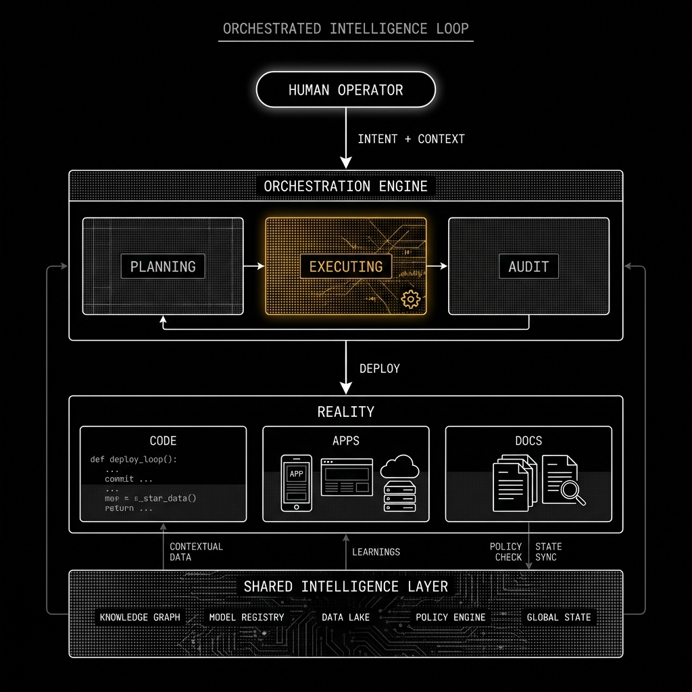

<!-- markdownlint-disable MD013 -->
# Joshua R. Lora | AI Infrastructure & Commercialization
Founder @ Protoperfect Labs | Federated AI Infrastructure for the Agentic Era

> *Building at the speed of thought.*
---

## The Acceleration of Possibility

As digital ecosystems become more sophisticated and targeted, engineering teams are under pressure to manage exponentially more context at a higher frequency.

Most operational models still rely on manual synchronization to align code with intent—a process that is slow, inconsistent, and expensive. I reimagine that workflow with **Orchestrated Intelligence**: an always-on agentic architecture that scans the entire project state—code, documentation, and design tokens—to build a map of *intent* versus *reality*.

That map helps the Architect understand what is required and routes execution decisions to specialized agents in a matter of seconds.

---

## Orchestrated Intelligence

At the core of my practice is a system of customizable AI agents designed to investigate requirements and carry out implementation decisions, all orchestrated by strictly typed higher-order reasoning models.

Once initialized, the agents continuously crawl surface areas—database schemas, UI components, and API contracts—to collect and interpret raw signals at scale.

**Detecting and Classifying Context Drift**

The system connects the dots across disparate environments, ensuring that every deployment is grounded in the latest architectural intent. When a mismatch is detected, the system triggers a resolution flow, allowing for high-velocity iteration with zero loss of integrity.

---

## Featured Projects

### [Protoperfect Labs](https://github.com/shifujosh/Protoperfect-Labs-Public)
**Federated Intelligence. Sovereign Execution.**

The foundational framework for building agentic swarms. It combines a robust orchestration kernel (**Cortex**) with the **BRASS** (Behavior, Request, Agent, State, Sync) protocol to ensure deterministic outputs from stochastic models.
- **Role:** Central Brain & Protocol Layer
- **Tech:** Next.js 15, Tailwind v4, BRASS Protocol

### [Aglet: The Cognitive OS](https://github.com/shifujosh/Aglet-Foundry)
**Stop fraying. Start finishing.**

Aglet is the "observation deck" for autonomous agents. It provides a visual interface for orchestrating intelligence, managing long-term **Synaptic Memory** using DuckDB, allowing agents to "remember" context, refine user intent, and autonomously promote facts from short-term staging to permanent knowledge.
- **Tech:** Next.js 15, DuckDB, Vector Search

### [Specter: The Digital Soul](https://specter.protoperfect.io)
**Automated content engine with a distinct personality.**

A consumer-facing platform powered by the Specter engine. It demonstrates the system's ability to process live data streams—sports, finance, media—and serve predictive modeling or high-energy content to end-users with zero latency.
- **Status:** Public Beta (Sovereign Limb)

### [Market Data Pipeline](https://github.com/shifujosh/Market-Data-Pipeline-Ref-)
**Financial-Grade Data Physics.**

A reference implementation of "Zero Silent Failure." Demonstrates how to apply HFT (High-Frequency Trading) principles—Dead Letter Queues, Tiered Validation, and Circuit Breakers—to modern AI systems.

---

## Leading Model Evaluations for Accuracy

I build with a **"Data Physics"** first approach.

In complex, high-stakes environments, reasoning across platforms and formats is essential. The models powering these systems must detect subtle patterns, connect related signals, and generate outputs that hold up under scrutiny.

If an agent cannot reason through the schema or validate against the contract, the code is rejected. This rigorous standard allows for high-velocity output without the "drift" common in AI-generated software.

---

## Connect

Based in **NYC**. **Cornell** Alum. **Lasagna** Enthusiast.

**LinkedIn:** [linkedin.com/in/joshualora](https://www.linkedin.com/in/joshualora)
