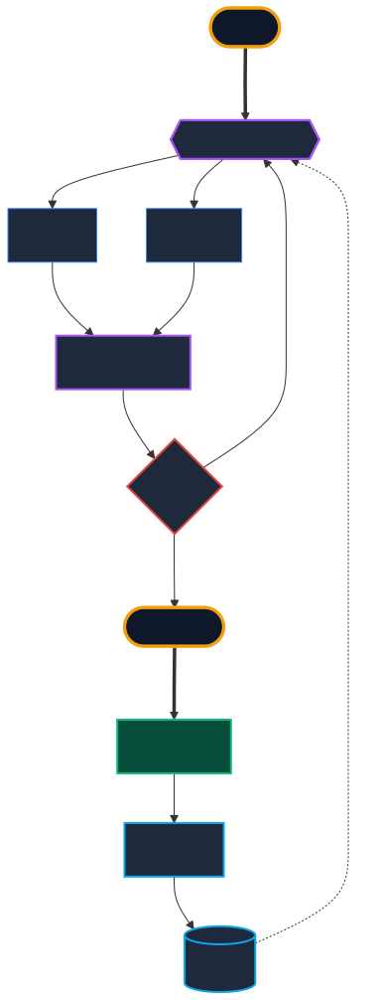

# Joshua Lora | AI-Native Product Architect

> *Architecting tools to augment human potential, not automate it away.*

---

## 🔭 Why I Build

**The Era of the Force Multiplier**

The definition of a "product team" is collapsing. We are entering an era where a single engineer, armed with the right "Cognitive Operating System," can execute the workload of a 15-person agency.

**The Shift:**
My bottleneck used to be bandwidth—I had more ideas than hours. AI changed the physics of execution. It allows me to research, prototype, and ship at enterprise scale, without the enterprise overhead.

**The Vision:**
I am building **JACQ** to solve "Context Amnesia." Most AI tools are just chatbots that forget everything when you close the tab. I am building a persistent digital workforce that lives in my coding environment, turning my intent into production-ready software.

---

## How It Works

I direct the work. AI does the heavy lifting. I treat models like specialized employees, not text generators.

> **[Full Architecture](https://github.com/shifujosh/JACQ-Architecture)**

---

## Validation: The Antigravity Sprint

35 days. Three production platforms. $792k agency estimate. My compute bill: under $1,000.

| Metric | Agency | My Output | Impact |
| :--- | :--- | :--- | :--- |
| **Speed** | 75 lines/day | 1,250 lines/day | **16x** |
| **Cost** | $792,000 | <$1,000 | **99% savings** |
| **Quality** | 5-10 bugs/1k | <1 bug/1k | **10x** |

> **[Full Case Study](https://github.com/shifujosh/Antigravity-Sprint-Retrospective)**

---

## What I'm Building

**JACQ** — *Cognitive Operating System.*
A unified workspace where AI helps research, write, code, and create. It remembers past work, learns preferences, and suggests next steps.

**Specter** — *Autonomous Intelligence Agent.*
Ingests data, runs analysis, fact-checks itself, generates content, and broadcasts—fully autonomously.

**BetSpecs** — *Real-Time Analytics Dashboard.*
Financial-terminal style interface. Live data, AI insights, performance tracking.

---

## Mission-Critical Data Operations: Bloomberg

Before AI, I managed data for global financial institutions. I learned what I call **Data Physics**: the principle that data must be treated like a physical asset. If the structure is wrong, everything downstream breaks.

That discipline—schema design, validation, error handling—is now the foundation of how I build AI systems. Fast *and* reliable.

---

## Philosophy

I design the system. AI writes the code.

I call this **Software as a Result**: I define the outcome, and the system produces the implementation. My job is architecture and logic. The commodity code is generated.

> *"The universe is made of stories, not of atoms."* — Muriel Rukeyser

---

## 📬 Connect

NYC born and raised. Cornell alum. Lasagna enthusiast.

**LinkedIn:** [linkedin.com/in/joshualora](https://www.linkedin.com/in/joshualora)
