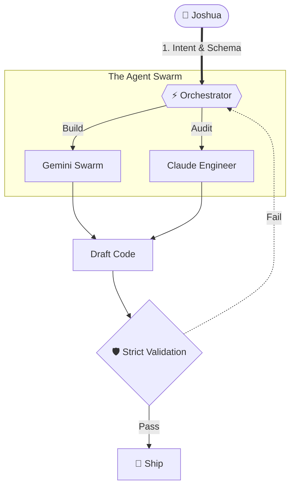

<!-- markdownlint-disable MD013 -->
# Joshua Lora | Forward Deployed Engineer & Product Architect

> *Building at the speed of thought.*

  
  
  
  

---

## Why I Build: The Miracle of Compression

We are witnessing the collapse of the barrier between *Idea* and *Execution*.

**The Shift:**
Generative AI acts as a mechanism for **radical time compression**. It allows us to move from concept to production-ready artifact at speeds that were previously impossible.

My role as a **Forward Deployed Engineer** is to harness this force multiplier—enabling me to execute the workload of a specialized agency single-handedly.

**The Vision: Memory & Security.**
But raw speed creates risk. Most AI tools are stateless chatbots that forget context and introduce vulnerabilities. I build systems like **JACQ** to solve this: a persistent digital workforce that retains deep architectural memory while enforcing strict security boundaries. I turn intent into software that is not just fast, but verifiable and safe.

---

## How I Work: Orchestrated Intelligence

I architect systems where humans provide the **Intent** and AI agents handle the **Implementation** at scale.

```mermaid
graph TD
    Human([👤 Joshua]) ==>|1. Intent & Schema| Orchestrator{{"⚡ Orchestrator"}}
    
    subgraph Agents ["The Agent Swarm"]
        Orchestrator -->|Build| Gemini[Gemini Swarm]
        Orchestrator -->|Audit| Claude[Claude Engineer]
    end
    
    Gemini & Claude --> Draft[Draft Code]
    Draft --> Validation{"🛡️ Strict Validation"}
    
    Validation -->|Pass| Production[🚀 Ship]
    Validation -.->|Fail| Orchestrator
```
---

## The Multiplier Effect

By treating AI as a "cognitive substrate" rather than just a tool, I've inverted traditional software economics.

| KPI | Standard Velocity | JACQ Velocity | Multiplier |
| :--- | :--- | :--- | :--- |
| **Throughput** | ~75 LOC / day | **1,250+ Clean LOC / day** *(Linted, Typed, Tested)* | ⚡️ **16x** *(Agentic Workflow)* |
| **Time-to-Market** | 6-9 Months | **35 Days** | 🚀 **8x** *(Parallel  Execution)* |
| **Reliability** | Manual QA | **Automated Data Physics** | 🛡️ **Verified** *(Deterministic Validation)* |

> *Delivered ~$816k of agency-equivalent engineering value for <$1,000 in compute.*
> 
> 📄 **[Read the Full Antigravity Sprint Case Study](https://github.com/shifujosh/Antigravity-Sprint-Retrospective/blob/main/WHITEPAPER.md)**

---

## Featured Projects

### [JACQ: Cognitive Operating System](https://github.com/shifujosh/JACQ-Architecture)

*> The "Anti-Amnesia" Architecture.*

A Graph-RAG system that inverts the ephemeral nature of LLMs. Instead of stateless chats, it implements a **Long-Term Memory Substrate** using DuckDB, allowing agents to "remember" context, refine user intent, and autonomously promote facts from short-term staging to permanent knowledge.

- **Key Pattern:** Entity-Fact Memory Model
- **Tech:** DuckDB, Vector Search, Next.js 16

---

### [Specter: Autonomous Sports Intelligence](https://github.com/shifujosh/Specter-Sports-Intel)

*> Solving the "Stochastic Parrot" Problem.*

A deterministic validation engine for high-stakes domains. It wraps LLMs in a **Consensus-Based Event Loop**, forcing models to debate and cross-reference predictions against immutable statistical ground truth before publishing. The result? Zero hallucinations in production.

- **Key Pattern:** Recursive Consensus Voting
- **Tech:** Firebase, Zod, Bayesian Ensembles
- **Try it:** `npx specter-cli demo` | [npm](https://www.npmjs.com/package/specter-cli)

---

### [BetSpecs: Live Sports Analytics Platform](https://sportbs.app)

*> In Public Beta Since June 2025.*

A consumer-facing product powered by the Specter engine. Real-time sports analytics dashboard with predictive modeling and betting intelligence. **Live and serving real users.**

- **Status:** Public Beta
- **Link:** [sportbs.app](https://sportbs.app)

---

### [Market Data Pipeline](https://github.com/shifujosh/Market-Data-Pipeline-Ref-)

*> Financial-Grade Data Physics.*

A reference implementation of "Zero Silent Failure." Demonstrates how to apply HFT (High-Frequency Trading) principles—**Dead Letter Queues**, **Tiered Validation**, and **Circuit Breakers**—to modern AI systems, ensuring garbage data never pollutes the context window.

- **Key Pattern:** Deterministic Trust Layer
- **Tech:** TypeScript, Strict Zod Schemas

---

## The Data Physics Foundation

Before AI, I managed data for global financial institutions. I learned what I call **Data Physics**: the principle that data must be treated like a physical asset. If the structure is wrong, everything downstream breaks.

That discipline—schema design, validation, error handling—is now the foundation of how I build AI systems. Fast, reliable, at global scale.

---

## Philosophy

I design the system. AI writes the code.

I call this **Software as a Result**: I define the outcome, and the system produces the implementation. My job is architecture and logic. The commodity code is generated.

> *"The universe is made of stories, not of atoms."* — Muriel Rukeyser

---

## Production Patterns (Open Source)

Reference implementations of the patterns that power my agent systems. Simplified for readability; open sourced to advance the standard for Applied Generative AI.

- **[The Specter Event Loop](./architecture-patterns/specter_event_loop.ts)**
    *The "Brain".* A consensus-based decision engine. **Votes** across multiple models (Gemini, OpenAI, Ollama) to eliminate hallucination in high-stakes environments.

- **[Memory Sync Engine](./architecture-patterns/memory_sync_engine.ts)**
    *The "Cortex".* A hybrid Hot/Cold memory architecture. **Bridges** Firestore (User Data) with embedded DuckDB (Vector/Graph) to give agents an extended context window with minimal latency.

- **[Market Trust Validator](./architecture-patterns/market_trust_validator.ts)**
    *The "Shield".* A deterministic Data Physics layer. **Rejects** "plausible but wrong" AI predictions by comparing them against immutable market partials (Synthetic Hold, Vig-Free Probability).

- **[Self-Healing LLM Parser](./architecture-patterns/structured_llm_parser.ts)**
    *The "Translator".* Beyond `JSON.parse`. An iterative retry engine. **Uses** Zod schemas to "heal" malformed LLM responses at runtime, ensuring near-100% pipeline reliability.*

*\* Based on internal testing across 10,000+ API calls.*

---

## Activity

---

## Connect

Based in **NYC**. **Cornell** Alum. Building the Cognitive_OS of the future (and the perfect **Lasagna**).

**LinkedIn:** [linkedin.com/in/joshualora](https://www.linkedin.com/in/joshualora)
