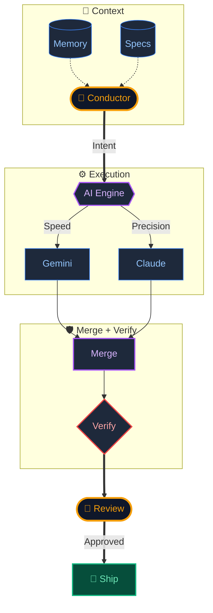

# Joshua Lora | AI-Native Product Architect

> *Architecting tools to augment human potential, not automate it away.*

---

### 🔭 Why I Build

I have endless curiosity and skills across many domains, but I am one person. AI changed that.

It lets me pursue ideas that used to require a team. I can research, prototype, and ship—faster than I ever thought possible. This is not about replacing human effort. It is about *expanding* what one person can do.

**The Problem:**
Today's AI tools are powerful but fragmented. Chat interfaces are too limited for real work. Developer tools are too complex for most people. The result: the magic of AI is locked behind a wall of technical skill.

**The Vision:**
I am building **JACQ**—a single workspace where research, writing, code, and visuals flow into one another. No switching apps. No learning new tools. Just ideas, made real.

---

### 🗺️ How It Works

I direct the work. AI does the heavy lifting. Think of it like conducting an orchestra: I set the direction, and specialized AI models execute in parallel.

```mermaid
graph TD
    classDef conductor fill:#0f172a,stroke:#f59e0b,stroke-width:3px,color:#f59e0b;
    classDef ai fill:#1e293b,stroke:#a855f7,stroke-width:2px,color:#d8b4fe;
    classDef work fill:#1e293b,stroke:#3b82f6,stroke-width:1px,color:#93c5fd;
    classDef check fill:#1e293b,stroke:#ef4444,stroke-width:2px,color:#fca5a5;
    classDef ship fill:#064e3b,stroke:#10b981,stroke-width:2px,color:#6ee7b7;

    subgraph Context ["🧠 Context"]
        Memory[(Memory)]:::work -.-> You
        Specs[(Specs)]:::work -.-> You
        You(["🎻 Conductor"]):::conductor
    end

    You ==>|Intent| AI{{"AI Engine"}}:::ai

    subgraph Execution ["⚙️ Execution"]
        AI -->|Speed| Gemini["Gemini"]:::work
        AI -->|Precision| Claude["Claude"]:::work
    end

    subgraph Quality ["🛡️ Merge + Verify"]
        Gemini & Claude --> Merge["Merge"]:::ai
        Merge --> Check{"Verify"}:::check
    end

    Check ==> Review(["👀 Review"]):::conductor
    Review ==>|Approved| Ship["🚀 Ship"]:::ship
```

> **[See the full JACQ Architecture](https://github.com/shifujosh/JACQ-Architecture)**

---

### 🚀 Proof: The "Antigravity" Sprint

In 35 days, I shipped three production-ready platforms. The same workload would cost $792k at an agency. My compute bill was under $1,000.

| Metric | Agency Estimate | My Output | Impact |
| :--- | :--- | :--- | :--- |
| **Speed** | 75 lines/day | 1,250 lines/day | **16x Faster** |
| **Cost** | ~$792,000 | <$1,000 | **99% Savings** |
| **Quality** | 5-10 bugs per 1k lines | <1 bug per 1k lines | **10x Better** |

> **[Read the full case study](https://github.com/shifujosh/Antigravity-Sprint-Retrospective)**

---

### 🏛️ What I Am Building

**JACQ** — *Cognitive Operating System.*
A unified workspace where AI helps me research, write, code, and create—all in one place. It remembers past work, learns my preferences, and proactively suggests next steps.

**Specter Bot** — *Autonomous sports intelligence agent.*
Ingests data from multiple sources, runs proprietary analysis, fact-checks itself, generates visual content, and broadcasts to social platforms—fully autonomously.

**BetSpecs** — *Real-time analytics dashboard.*
A financial-terminal style interface for sports analytics. Real-time data, AI-driven insights, and performance tracking.

---

### ⚡ The Foundation: Bloomberg

Before AI, I managed data for global financial institutions. I learned what I call **"Data Physics"**: the principle that data must be treated like a physical asset. If the structure is wrong, everything downstream breaks.

That discipline—schema design, validation, error handling—is now the foundation of how I build AI systems. They are fast *and* reliable.

---

### 🧠 Philosophy

I design the system. AI writes the code.

I call this **"Software as a Result"**: I define the outcome I want, and the system produces the implementation. My job is architecture and logic. The commodity code is generated.

---

### 🛠️ Tools I Use

| Role | Tool | Why |
| :--- | :--- | :--- |
| **Director** | Ollama (runs locally) | Fast routing, private data |
| **Precision** | Claude | Deep logic, code audits |
| **Speed** | Gemini | Rapid prototyping, image generation |

Automation: Code is automatically reviewed, scanned for vulnerabilities, and tested before it ships.

---

### 📬 Connect

* **LinkedIn:** [linkedin.com/in/joshualora](https://www.linkedin.com/in/joshualora)
