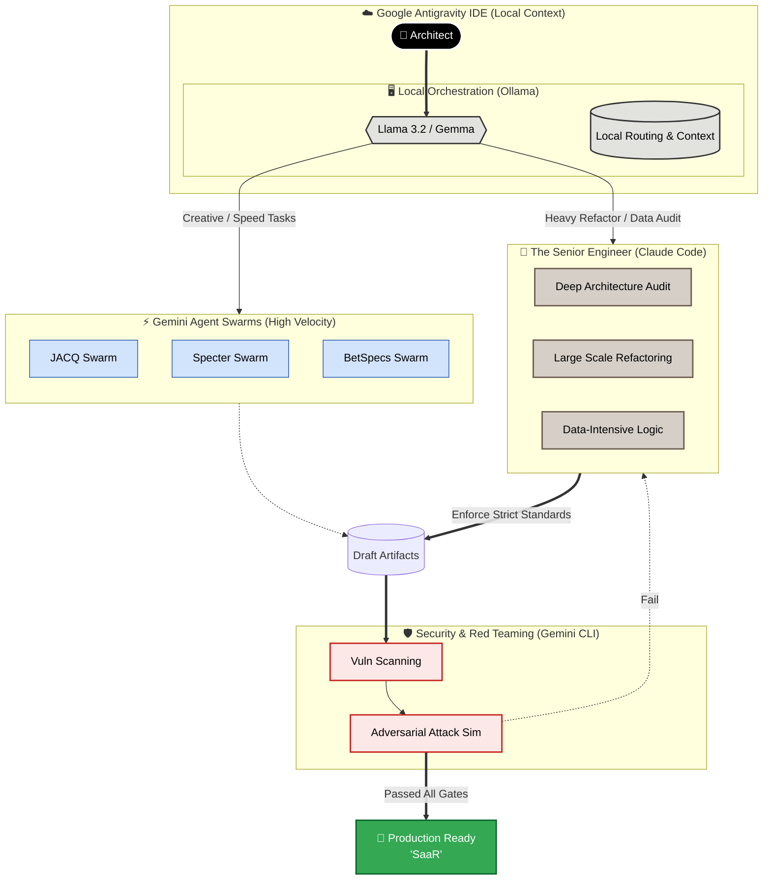

### Hi, I'm Joshua 👋 **AI-Native Product Architect**

## I bridge the gap between Enterprise Data Reliability and Agentic AI Systems.
My experience ranges from managing global data pipelines at **Bloomberg** to orchestrating AI agent swarms that build full-stack software at **16x industry velocity**.

I don't just write code; I architect the **"Cognitive Operating Systems"** that generate it.

---

### 🗺️ The Architecture: Federated Tiered Intelligence
I utilize a "Model Meritocracy" approach, routing tasks to the specific model best suited for the cognitive load—from local orchestration to high-level architectural auditing.

```mermaid
graph TD
    %% --- Styling ---
    classDef human fill:#000,stroke:#fff,stroke-width:2px,color:#fff;
    classDef local fill:#e2e2df,stroke:#333,stroke-width:2px,color:#000;
    classDef senior fill:#d6cfc7,stroke:#6b5b4e,stroke-width:2px,color:#000;
    classDef swarm fill:#d2e3fc,stroke:#174ea6,stroke-width:1px,color:#000;
    classDef security fill:#fce8e6,stroke:#c5221f,stroke-width:2px,color:#000;
    classDef output fill:#34a853,stroke:#0d652d,stroke-width:2px,color:#fff;

    %% --- IDE Context ---
    subgraph IDE_Context ["☁️ Google Antigravity IDE (Local Context)"]
        Human([👤 Architect]):::human
        
        subgraph Local_Brain ["🖥️ Local Orchestration (Ollama)"]
            Router{{Llama 3.2 / Gemma}}:::local
            Note1[("Local Routing & Context")]:::local
        end

        Human ==> Router
    end

    %% --- Task Delegation ---
    Router -->|Creative / Speed Tasks| Swarms
    Router -->|Heavy Refactor / Data Audit| Senior_Eng

    %% --- The Creative Layer ---
    subgraph Swarms ["⚡ Gemini Agent Swarms (High Velocity)"]
        direction TB
        JACQ_Ag[JACQ Swarm]:::swarm
        Spec_Ag[Specter Swarm]:::swarm
        Bet_Ag[BetSpecs Swarm]:::swarm
    end

    %% --- The Senior Engineer Layer ---
    subgraph Senior_Eng ["🧐 The Senior Engineer (Claude Code)"]
        Deep_Audit[Deep Architecture Audit]:::senior
        Refactor[Large Scale Refactoring]:::senior
        Data_Pipe[Data-Intensive Logic]:::senior
    end

    %% --- Convergence ---
    Swarms -.-> Draft_Code[("Draft Artifacts")]
    Senior_Eng ==>|Enforce Strict Standards| Draft_Code

    %% --- The Security Gauntlet ---
    subgraph Security_Layer ["🛡️ Security & Red Teaming (Gemini CLI)"]
        SecOps[Vuln Scanning]:::security
        RedTeam[Adversarial Attack Sim]:::security
    end

    Draft_Code ==> SecOps
    SecOps --> RedTeam

    %% --- Final Output ---
    RedTeam ==>|Passed All Gates| Production[🚀 Production Ready\n'SaaR']:::output
    RedTeam -.->|Fail| Senior_Eng

```

---

### 🚀 Case Study: The "Antigravity" Sprint (2025/2026)

*Proof of Concept for "Software as a Result" (SaaR)*

> **[📄 Read the Full Whitepaper & Metrics Analysis](https://github.com/shifujosh/Antigravity-Sprint-Retrospective)**

In late 2025, I executed an engineering workload equivalent to a 15-person specialized agency, delivering three production-ready platforms in **35 days**.

| Metric | Industry Standard | Antigravity Agent Swarm | Impact |
| --- | --- | --- | --- |
| **Velocity** | ~75 LOC / day | **1,250 LOC / day** | **16.6x Speed** |
| **Cost** | ~$792,000 (Agency Eq.) | **<$1,000 (Compute)** | **99% Savings** |
| **Quality** | 5-10 Defects / 1k LOC | **<1 Defect / 1k LOC** | **High Reliability** |
| **Lead Time** | 4-6 Months | **3-5 Weeks** | **Rapid Delivery** |

---

### 🏛️ Applied AI Research Lab (Current Work)

*Focus: Full-stack orchestration of AI-native systems to solve for context amnesia and reliability.*

**1. JACQ (Cognitive Operating System)**

* **The Architecture:** A local-first agent orchestration engine featuring a central "Brain" that manages specialized sub-agents.
* **The Engineering:** Refactored **31,080 LOC** in a single sprint. Implemented full **Zod schema validation** and **Playwright E2E testing** to ensure deterministic outputs.
* **The Win:** Transitioned to a local **DuckDB/Dexie** architecture, reducing cloud database latency and costs by 40%.

**2. BetSpecs (Real-Time Analytics Engine)**

* **The Architecture:** An enterprise monorepo combining high-frequency data scraping with real-time odds modeling.
* **The Engineering:** Shared library architecture ensuring **100% type safety** between data ingestion and UI display.
* **The Win:** Eliminated numerical hallucinations by implementing a verification layer that cross-references LLM outputs against raw "Ground Truth" data tables.

---

### ⚡ Enterprise Background (The Foundation)

**Bloomberg | Enterprise Data Operations**

* **The Scale:** Managed data acquisition and delivery for global market makers and hedge funds.
* **The Stack:** ETL Pipelines, Cloud Delivery (S3), Apache Kafka / Event Streaming, SQL Optimization.
* **The Bridge:** This experience taught me **"Data Physics"**—reliability, schemas, and the cost of errors. I now apply this rigorous data discipline to the probabilistic world of AI agents.

---

### 🧠 The Philosophy: Architect > Bricklayer

I operate on a **"Software as a Result" (SaaR)** model. I prioritize **System Architecture** and **Data Logic** over boilerplate syntax. My expertise lies in designing the schema, logic flow, and orchestration layers that allow AI agents to produce commodity code reliably.

---

### 🛠️ Technical Arsenal & Operations

I utilize a **"Tiered Intelligence"** architecture, routing tasks to models based on cognitive requirements:

* **The Orchestrator (Local):** **Ollama (Llama 3.2 / Gemma)** running locally for low-latency routing and private context management.
* **The Senior Engineer (Deep Thought):** **Claude Code** handles massive refactors, strict code auditing, and data-intensive logic verification.
* **The Workforce (High Velocity):** **Gemini 1.5 Pro/Flash** swarms for rapid prototyping, image generation, and security "Red Teaming."

#### ⚙️ Automated DevOps & Security

* **Agentic Git Operations:** Automated atomic commits with semantic messaging, PR generation, and self-resolving merge conflicts.
* **The CI/CD Gauntlet:** GitHub Actions pipelines that trigger agentic vulnerability scanning (Snyk/npm audit) and Playwright E2E regression tests before merge.
* **Dependency Hardening:** Automated dependency updates and security patching to maintain supply chain integrity.

---

### 📬 Connection

* **LinkedIn:** [linkedin.com/in/joshualora](https://www.linkedin.com/in/joshualora)
