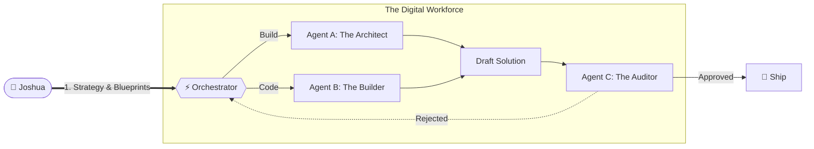

<!-- markdownlint-disable MD013 -->
# Joshua R. Lora | Forward Deployed Engineer

> *Building at the speed of thought.*
---

## The Acceleration of Possibility

We are witnessing the collapse of latency between *Ideas* and *Reality*.

**Generative AI** has introduced **hyperbolic time compression** to the craft of building. We can bypass the friction of traditional development turning human intent into deployed application at speeds that feel indistinguishable from magic. This is a fundamental phase shift in how value is created.

As a **Forward Deployed Engineer**, I operate as a force multiplier on this new frontier. My mandate is to capture this lightning and ground it in utility—transforming raw, chaotic possibility into concrete solutions that serve human needs.

But velocity demands structure. In a landscape of stateless, amnesic models, I build systems like **JACQ** to provide the missing substrate: a persistent digital workforce that retains deep architectural memory while enforcing strict security boundaries. I turn intent into software that is verifiable, safe, and built to last.

---

## How I Work: Orchestrated Intelligence

Instead of using AI as a chatbot; I manage it as a **digital workforce**.

To achieve agency-level output as a single engineer, I have architected a system where I act as the **Product Lead**, and a swarm of specialized AI agents acts as my development team.

**The Workflow:**
1.  **I Define the Intent:** I provide the architectural blueprints and business logic. I set the "Why" and the "What."
2.  **The Swarm Builds (Scale):** specialized agents write the code in parallel. One agent focuses on database structure, another on the user interface, and another on documentation.
3.  **The Critic Validates (Safety):** Before any code is accepted, a separate "Auditor Agent" acts as Quality Assurance. It reviews the work for bugs and security risks. If the code isn't perfect, the Auditor rejects it and forces a rewrite.

This loop allows me to maintain **human strategic control** while leveraging **machine speed** for execution.

```mermaid
graph LR
    Human([👤 Joshua]) ==>|1. Strategy & Blueprints| Orchestrator{{"⚡ Orchestrator"}}
    
    subgraph Swarm ["The Digital Workforce"]
        Orchestrator -->|Build| Architect[Agent A: The Architect]
        Orchestrator -->|Code| Builder[Agent B: The Builder]
        
        Architect & Builder --> Draft[Draft Solution]
        
        Draft --> Auditor[Agent C: The Auditor]
    end
    
    Auditor -->|Approved| Production[🚀 Ship]
    Auditor -.->|Rejected| Orchestrator
```
---

## The Multiplier Effect

By treating AI as a "cognitive substrate" rather than just a tool, I've inverted traditional software economics.

| KPI | Standard Velocity | JACQ Velocity | Multiplier |
| :--- | :--- | :--- | :--- |
| **Throughput** | ~75 LOC / day | **1,250+ Clean LOC / day** *(Linted, Typed, Tested)* | ⚡️ **16x** *(Agentic Workflow)* |
| **Time-to-Market** | 6-9 Months | **35 Days** | 🚀 **8x** *(Parallel  Execution)* |
| **Reliability** | Manual QA | **Automated Data Physics** | 🛡️ **Verified** *(Deterministic Validation)* |

> *Delivered ~$816k of agency-equivalent engineering value for <$1,000 in compute.*
> 
> 📄 **[Read the Full Antigravity Sprint Case Study](https://github.com/shifujosh/Antigravity-Sprint-Retrospective/blob/main/WHITEPAPER.md)**

---

## Featured Projects

### [JACQ: Cognitive Operating System](https://github.com/shifujosh/JACQ-Architecture)

*> The "Anti-Amnesia" Architecture.*

A Graph-RAG system that inverts the ephemeral nature of LLMs. Instead of stateless chats, it implements a **Long-Term Memory Substrate** using DuckDB, allowing agents to "remember" context, refine user intent, and autonomously promote facts from short-term staging to permanent knowledge.

- **Key Pattern:** Entity-Fact Memory Model
- **Tech:** DuckDB, Vector Search, Next.js 16

---

### [Specter: Autonomous Sports Intelligence](https://github.com/shifujosh/Specter-Sports-Intel)

*> Solving the "Stochastic Parrot" Problem.*

A deterministic validation engine for high-stakes domains. It wraps LLMs in a **Consensus-Based Event Loop**, forcing models to debate and cross-reference predictions against immutable statistical ground truth before publishing. The result? **Production-Grade Reliability** in stochastic environments.

- **Key Pattern:** Recursive Consensus Voting
- **Tech:** Firebase, Zod, Bayesian Ensembles
- **Try it:** `npx specter-cli demo` | [npm](https://www.npmjs.com/package/specter-cli)

---

### [BetSpecs: Live Sports Analytics Platform](https://sportbs.app)

*> In Public Beta Since June 2025.*

A consumer-facing product powered by the Specter engine. Real-time sports analytics dashboard with predictive modeling and betting intelligence. **Live and serving real users.**

- **Status:** Public Beta
- **Link:** [sportbs.app](https://sportbs.app)

---

### [Market Data Pipeline](https://github.com/shifujosh/Market-Data-Pipeline-Ref-)

*> Financial-Grade Data Physics.*

A reference implementation of "Zero Silent Failure." Demonstrates how to apply HFT (High-Frequency Trading) principles—**Dead Letter Queues**, **Tiered Validation**, and **Circuit Breakers**—to modern AI systems, ensuring garbage data never pollutes the context window.

- **Key Pattern:** Deterministic Trust Layer
- **Tech:** TypeScript, Strict Zod Schemas

---

## The Data Physics Foundation

Before AI, I managed data for global financial institutions. I learned what I call **Data Physics**: the principle that data must be treated like a physical asset. If the structure is wrong, everything downstream breaks.

That discipline—schema design, validation, error handling—is now the foundation of how I build AI systems. Fast, reliable, at global scale.

---

## Philosophy

I design the system. AI writes the code.

I call this **Software as a Result**: I define the outcome, and the system produces the implementation. My job is architecture and logic. The commodity code is generated.

> *"The universe is made of stories, not of atoms."* — Muriel Rukeyser

---

## Production Patterns (Open Source)

Reference implementations of the patterns that power my agent systems. Simplified for readability; open sourced to advance the standard for Applied Generative AI.

- **[The Specter Event Loop](./architecture-patterns/specter_event_loop.ts)**
    *The "Brain".* A consensus-based decision engine. **Votes** across multiple models (Gemini, OpenAI, Ollama) to eliminate hallucination in high-stakes environments.

- **[Memory Sync Engine](./architecture-patterns/memory_sync_engine.ts)**
    *The "Cortex".* A hybrid Hot/Cold memory architecture. **Bridges** Firestore (User Data) with embedded DuckDB (Vector/Graph) to give agents an extended context window with minimal latency.

- **[Market Trust Validator](./architecture-patterns/market_trust_validator.ts)**
    *The "Shield".* A deterministic Data Physics layer. **Rejects** "plausible but wrong" AI predictions by comparing them against immutable market partials (Synthetic Hold, Vig-Free Probability).

- **[Self-Healing LLM Parser](./architecture-patterns/structured_llm_parser.ts)**
    *The "Translator".* Beyond `JSON.parse`. An iterative retry engine. **Uses** Zod schemas to "heal" malformed LLM responses at runtime, ensuring near-100% pipeline reliability.*

*\* Based on internal testing across 10,000+ API calls.*

---

## 2025 Development Highlights

> *Velocity is a vector. It has both speed and direction.*

### 🚀 **Production Systems**

- **Consumer-Facing Analytics:** Deployed real-time predictive dashboards serving live traffic (`sportbs.app`).
- **Hybrid Memory Architectures:** Engineering "Cognitive OS" workspaces that bridge vector search (DuckDB) with transactional data (Firestore).
- **Deterministic AI Pipelines:** Productionized `specter-cli` (npm), replacing stochastic LLM outputs with consensus-based verification layers.

### ⚡ **Engineering Velocity**

- **Agentic Workflow:** Averaging **~1,250+ Clean LOC / day** via AI-augmented development.
- **Contribution Volume:** Sustained high-velocity output across **29+ repositories** (Public & Private).
- **Defensive Architecture:** Prioritizing "Data Physics" patterns to strictly validate all AI-generated outputs.

---

## Connect

Based in **NYC**. **Cornell** Alum.**Lasagna** Enthusiast.

**LinkedIn:** [linkedin.com/in/joshualora](https://www.linkedin.com/in/joshualora)
