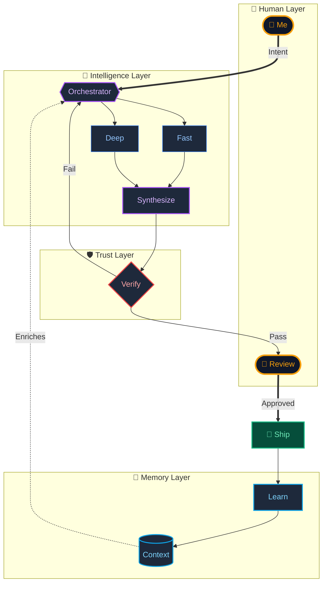

# Joshua Lora | AI-Native Product Architect

> *Augmenting human potential, not automating it away.*

---

### 🔭 Why I Build

I have endless curiosity and skills across many domains—but I am one person. AI changed that.

Now I can pursue ideas that used to require a team. I research, prototype, and ship faster than I ever thought possible. This is not about replacing human effort. It is about *expanding* what one person can do.

**The Problem:** Today's AI tools are powerful but fragmented. Chat is too limited for real work. Developer tools are too complex for most people. The magic of AI is locked behind a wall of technical skill.

**The Vision:** A single workspace where research, writing, code, and visuals flow into one another. No switching apps. No learning new tools. Just ideas, made real.

---

### 🗺️ How It Works

I direct the work. AI does the heavy lifting.

```mermaid
graph TD
    classDef human fill:#0f172a,stroke:#f59e0b,stroke-width:3px,color:#f59e0b;
    classDef ai fill:#1e293b,stroke:#a855f7,stroke-width:2px,color:#d8b4fe;
    classDef work fill:#1e293b,stroke:#3b82f6,stroke-width:1px,color:#93c5fd;
    classDef verify fill:#1e293b,stroke:#ef4444,stroke-width:2px,color:#fca5a5;
    classDef memory fill:#1e293b,stroke:#0ea5e9,stroke-width:2px,color:#7dd3fc;
    classDef ship fill:#064e3b,stroke:#10b981,stroke-width:2px,color:#6ee7b7;

    subgraph Human ["🎯 Human Layer"]
        Me(["👤 Me"]):::human
        Review(["👀 Review"]):::human
    end

    subgraph Intelligence ["🧠 Intelligence Layer"]
        Engine{{"Orchestrator"}}:::ai
        Fast["Fast"]:::work
        Deep["Deep"]:::work
        Synthesize["Synthesize"]:::ai
    end

    subgraph Trust ["🛡️ Trust Layer"]
        Verify{"Verify"}:::verify
    end

    subgraph Memory ["💾 Memory Layer"]
        Context[(Context)]:::memory
        Learn["Learn"]:::memory
    end

    Me ==>|Intent| Engine
    Context -.->|Enriches| Engine
    
    Engine --> Fast & Deep
    Fast & Deep --> Synthesize
    Synthesize --> Verify
    
    Verify -->|Fail| Engine
    Verify -->|Pass| Review
    Review ==>|Approved| Ship["🚀 Ship"]:::ship
    
    Ship --> Learn
    Learn --> Context
```

> **[Full Architecture](https://github.com/shifujosh/JACQ-Architecture)**

---

### 🚀 Proof: The Antigravity Sprint

35 days. Three production platforms. $792k agency estimate. My compute bill: under $1,000.

| Metric | Agency | My Output | Impact |
| :--- | :--- | :--- | :--- |
| **Speed** | 75 lines/day | 1,250 lines/day | **16x** |
| **Cost** | $792,000 | <$1,000 | **99% savings** |
| **Quality** | 5-10 bugs/1k | <1 bug/1k | **10x** |

> **[Full Case Study](https://github.com/shifujosh/Antigravity-Sprint-Retrospective)**

---

### 🏛️ What I Am Building

**JACQ** — *Cognitive Operating System.*
A unified workspace where AI helps research, write, code, and create. It remembers past work, learns preferences, and suggests next steps.

**Specter** — *Autonomous Intelligence Agent.*
Ingests data, runs analysis, fact-checks itself, generates content, and broadcasts—fully autonomously.

**BetSpecs** — *Real-Time Analytics Dashboard.*
Financial-terminal style interface. Live data, AI insights, performance tracking.

---

### ⚡ The Foundation: Bloomberg

Before AI, I managed data for global financial institutions. I learned what I call **Data Physics**: the principle that data must be treated like a physical asset. If the structure is wrong, everything downstream breaks.

That discipline—schema design, validation, error handling—is now the foundation of how I build AI systems. Fast *and* reliable.

---

### 🧠 Philosophy

I design the system. AI writes the code.

I call this **Software as a Result**: I define the outcome, and the system produces the implementation. My job is architecture and logic. The commodity code is generated.

---

### 📬 Connect

**LinkedIn:** [linkedin.com/in/joshualora](https://www.linkedin.com/in/joshualora)
