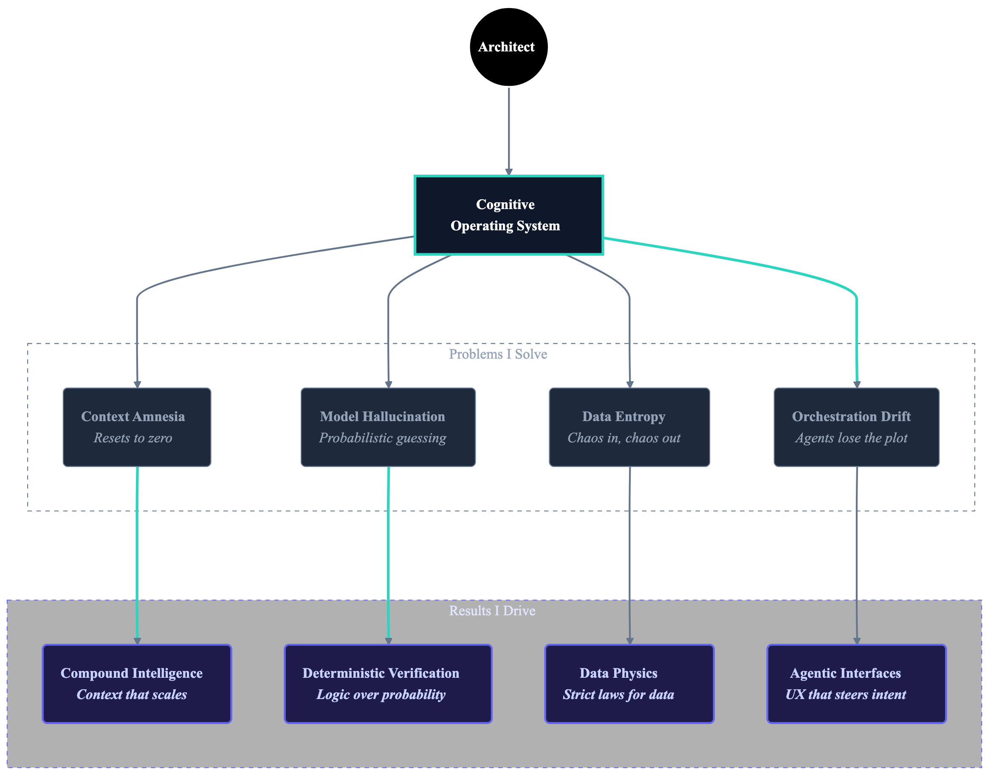

# Joshua Lora | AI-Native Product Architect

> *Developing technology for human flourishing.*

  
  
  
  

---

## What I've Shipped

| Project | What It Does | Stack | Tests |
|:--------|:-------------|:------|:-----:|
| [**JACQ**](https://github.com/shifujosh/JACQ-Architecture) | AI memory system with Graph-RAG | TypeScript, DuckDB, Next.js&nbsp;16 | 27 |
| [**Specter**](https://github.com/shifujosh/Specter-Sports-Intel) | Agentic sports analytics & social engagement | TypeScript, Firebase, Zod | 25 |
| [**Market&nbsp;Pipeline**](https://github.com/shifujosh/Market-Data-Pipeline-Ref-) | Financial-grade data validation | TypeScript, TimescaleDB | 22 |

<strong>Code Samples</strong>

Each repo includes runnable demos and tested implementations:

**JACQ** — `examples/graph_rag_demo.ts` demonstrates Entity-Fact memory with staging policies  
**Specter** — `examples/analysis_demo.ts` shows multi-model ensemble voting  
**Market Pipeline** — `ts/src/validators/ingestion-engine.ts` implements tiered validation (Hard/Soft/Warning)

---

## Why I Build

**The Era of the Force Multiplier**

The definition of a "product team" is collapsing. We are entering an era where a single engineer, armed with the right "Cognitive Operating System," can execute the workload of a 15-person agency.

**The Shift:**
My bottleneck used to be bandwidth—I had more ideas than hours. AI changed the physics of execution. It allows me to research, prototype, and ship at enterprise scale, without the enterprise overhead.

**The Vision:**
I am building **JACQ** to solve "Context Amnesia." Most AI tools are just chatbots that forget everything when you close the tab. I am building a persistent digital workforce that lives in my coding environment, turning my intent into production-ready software.

---

## How It Works

I direct the work. AI does the heavy lifting. I treat models like specialized employees, not text generators.

> *Problems I Solve → Results I Drive*

---

## Validation: Antigravity Sprint

35 days. Three production platforms. $792k agency estimate. My compute bill: under $1,000.

| Metric | Agency | My Output | Impact |
| :--- | :--- | :--- | :--- |
| **Speed** | 75 lines/day | 1,250 lines/day | **16x** |
| **Cost** | $792,000 | <$1,000 | **99% savings** |
| **Quality** | 5-10 bugs/1k | <1 bug/1k | **10x** |

---

## Featured Projects

### [JACQ: Cognitive Operating System](https://github.com/shifujosh/JACQ-Architecture)

*Local-First AI Workspace with Graph-RAG Memory.*

A unified OS that remembers past work, learns preferences, and suggests next steps. Implements Entity-Fact memory model with staging policies for fact promotion and decay.

**Key Innovations:**
- Graph-RAG retrieval combining vector search with spreading activation
- Entity-Fact memory model with confirmation scoring
- Orchestrator pattern for multi-agent coordination

---

### [Specter: Autonomous Sports Intelligence](https://github.com/shifujosh/Specter-Sports-Intel)

*Deterministic RAG & Real-Time Verification for Sports Analytics.*

Ingests data, runs ensemble analysis, fact-checks itself, generates content, and broadcasts—fully autonomously. Solves the "LLM Hallucination" problem with a verification-first architecture.

**Key Innovations:**
- 3-Model Ensemble Voting (Bayesian + Elo + Rules Engine)
- Deterministic Verification Layer (fact-checking before output)
- Velocity Tracker for detecting sharp money movement

---

### [Market Data Pipeline](https://github.com/shifujosh/Market-Data-Pipeline-Ref-)

*Data Physics - Enterprise-Grade Validation Patterns.*

Reference architecture demonstrating financial-grade data validation learned from managing high-frequency trading pipelines. These same principles power the "Trust Layer" in my AI systems.

**Key Innovations:**
- Tiered Validation (Hard/Soft/Warning)
- Dead Letter Queue for zero silent data loss
- Price Inertia detection for anomaly flagging

---

## The Data Physics Foundation

Before AI, I managed data for global financial institutions. I learned what I call **Data Physics**: the principle that data must be treated like a physical asset. If the structure is wrong, everything downstream breaks.

That discipline—schema design, validation, error handling—is now the foundation of how I build AI systems. Fast, reliable, at global scale.

---

## Philosophy

I design the system. AI writes the code.

I call this **Software as a Result**: I define the outcome, and the system produces the implementation. My job is architecture and logic. The commodity code is generated.

> *"The universe is made of stories, not of atoms."* — Muriel Rukeyser

---

## Architecture Patterns (Open Source)

I believe in **working in public**. I've extracted key patterns from my private engineering work and open-sourced them as reference implementations:

- **[The Specter Event Loop](./architecture-patterns/specter_event_loop.ts)**: A consensus-based autonomous decision cycle for high-variance domains.
- **[Memory Sync Engine](./architecture-patterns/memory_sync_engine.ts)**: Hybrid "Hot/Cold" memory architecture bridging Firestore and DuckDB.
- **[Self-Healing LLM Parser](./architecture-patterns/structured_llm_parser.ts)**: Robust structured data extraction with Zod and exponential backoff.
- **[Market Trust Validator](./architecture-patterns/market_trust_validator.ts)**: Deterministic "Trust Layer" comparing AI signals against Vig-free market physics.

---

## Connect

NYC born and raised. Cornell alum. Lasagna enthusiast.

**LinkedIn:** [linkedin.com/in/joshualora](https://www.linkedin.com/in/joshualora)
