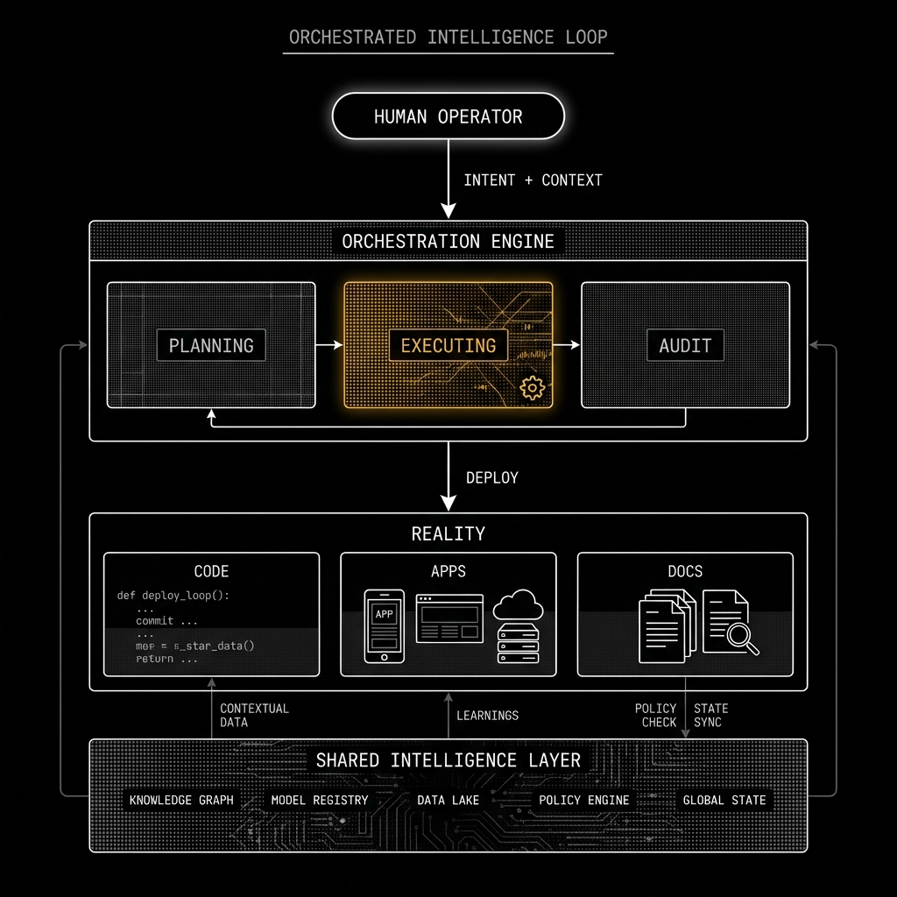

<!-- markdownlint-disable MD013 -->
# Joshua R. Lora | AI Infrastructure & Commercialization
Founder @ Protoperfect Labs | Federated AI Infrastructure for the Agentic Era

> *Building at the speed of thought.*
---

## The Acceleration of Possibility

As digital ecosystems become more sophisticated and targeted, engineering teams are under pressure to manage exponentially more context at a higher frequency.

Most operational models still rely on manual synchronization to align code with intent—a process that is slow, inconsistent, and expensive. I reimagine that workflow with **Orchestrated Intelligence**: an always-on agentic architecture that scans the entire project state—code, documentation, and design tokens—to build a map of *intent* versus *reality*.

That map helps the Architect understand what is required and routes execution decisions to specialized agents in a matter of seconds.

---

## Orchestrated Intelligence

At the core of my practice is a system of customizable AI agents designed to investigate requirements and carry out implementation decisions, all orchestrated by strictly typed higher-order reasoning models.

Once initialized, the agents continuously crawl surface areas—database schemas, UI components, and API contracts—to collect and interpret raw signals at scale.

**Detecting and Classifying Context Drift**

The system connects the dots across disparate environments to reveal larger patterns, like when a backend schema change requires a corresponding update in the design system or a security rule adjustment. I am building toward higher-order reasoning that helps agents detect "silent failures"—subtle architectural implementations that compile but violate business logic.

**Taking Precise Action with Function Calling**

Once a task meets the implementation criteria, function calling allows the agent to automatically compile the relevant context, draft the code, and file the resolution. These actions are taken quickly and are logged and auditable, with outputs optimized to meet the strict "Data Physics" compliance requirements of the system.

---

## Featured Projects

### [Specter: Autonomous Sports Intelligence](https://github.com/shifujosh/Specter-Sports-Intel)
**Detecting and classifying uncertainty with consensus models.**

Specter wraps stochastic LLMs in a deterministic **Consensus-Based Event Loop**. It forces models to debate and cross-reference predictions against immutable statistical ground truth before publishing. The result is production-grade reliability in high-stakes, stochastic environments.
- **Tech:** Node.js, Firebase, Bayesian Ensembles

### [JACQ: Cognitive Operating System](https://github.com/shifujosh/JACQ-Architecture)
**Bridging the context gap with graph memory.**

A generic "Cognitive OS" that inverts the ephemeral nature of AI. Instead of stateless chats, it implements a **Long-Term Memory Substrate** using DuckDB, allowing agents to "remember" context, refine user intent, and autonomously promote facts from short-term staging to permanent knowledge.
- **Tech:** Next.js 16, DuckDB, Vector Search

### [BetSpecs: Live Sports Analytics](https://sportbs.app)
**Real-time intelligence at scale.**

A consumer-facing platform powered by the Specter engine. It demonstrates the system's ability to process live data streams and serve predictive modeling to end-users with zero latency.
- **Status:** Public Beta

### [Market Data Pipeline](https://github.com/shifujosh/Market-Data-Pipeline-Ref-)
**Financial-Grade Data Physics.**

A reference implementation of "Zero Silent Failure." Demonstrates how to apply HFT (High-Frequency Trading) principles—Dead Letter Queues, Tiered Validation, and Circuit Breakers—to modern AI systems.

---

## Leading Model Evaluations for Accuracy

I build with a **"Data Physics"** first approach.

In complex, high-stakes environments, reasoning across platforms and formats is essential. The models powering these systems must detect subtle patterns, connect related signals, and generate outputs that hold up under scrutiny.

If an agent cannot reason through the schema or validate against the contract, the code is rejected. This rigorous standard allows for high-velocity output without the "drift" common in AI-generated software.

> *"The models make it possible to build and automate parts of this workflow that weren't feasible before this generation of agentic AI."*

---

## Connect

Based in **NYC**. **Cornell** Alum. **Lasagna** Enthusiast.

**LinkedIn:** [linkedin.com/in/joshualora](https://www.linkedin.com/in/joshualora)
