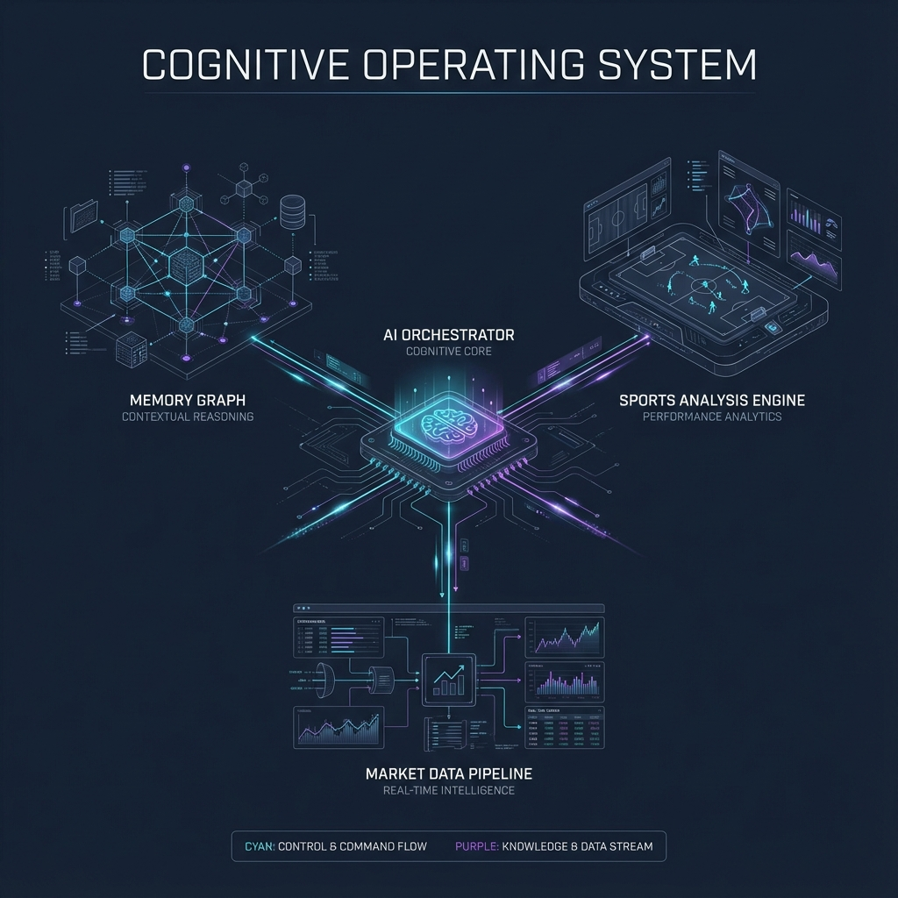

# Joshua Lora | AI-Native Product Architect

> *Developing technology for human flourishing.*

  
  
  
  

---

## What I've Shipped

| Project | What It Does | Stack | Tests |
| :--- | :--- | :--- | :---: |
| [**JACQ**](https://github.com/shifujosh/JACQ-Architecture) | AI memory system with Graph-RAG | TypeScript, DuckDB, Next.js&nbsp;16 | 27 |
| [**Specter**](https://github.com/shifujosh/Specter-Sports-Intel) | Agentic sports analytics & social engagement | TypeScript, Firebase, Zod | 25 |
| [**Market&nbsp;Pipeline**](https://github.com/shifujosh/Market-Data-Pipeline-Ref-) | Financial-grade data validation | TypeScript, TimescaleDB | 22 |

<strong>Code Samples</strong>

Each repo includes runnable demos and tested implementations:

**JACQ** — `examples/graph_rag_demo.ts` demonstrates Entity-Fact memory with staging policies  
**Specter** — `examples/analysis_demo.ts` shows multi-model ensemble voting  
**Market Pipeline** — `ts/src/validators/ingestion-engine.ts` implements tiered validation (Hard/Soft/Warning)

---

## Why I Build

### The Era of the Force Multiplier

The definition of a "product team" is collapsing. We are entering an era where a single engineer, armed with the right "Cognitive Operating System," can execute the workload of a 15-person agency.

**The Shift:**
My bottleneck used to be bandwidth—I had more ideas than hours. AI changed the physics of execution. It allows me to research, prototype, and ship at enterprise scale, without the enterprise overhead.

**The Vision:**
I am building **JACQ** to solve "Context Amnesia." Most AI tools are just chatbots that forget everything when you close the tab. I am building a persistent digital workforce that lives in my coding environment, turning my intent into production-ready software.

---

## How I Work: Orchestrated Intelligence

This diagram represents my "Cognitive Operating System"—a human-in-the-loop architecture where I direct a federation of specialized AI agents. I provide the intent, critical feedback (RLHF), and final sign-off, while agents handle the memory retrieval, drafting, and validation.

> *Human Intent → AI Scale → Verified Output*

---

## The Multiplier Effect

By treating AI as a "cognitive substrate" rather than just a tool, I've inverted traditional software economics.

| KPI | Standard Velocity | JACQ Velocity | Multiplier |
| :--- | :--- | :--- | :--- |
| **Throughput** | ~75 LOC / day | **>1,250 LOC / day** | ⚡️ **16x** *(Agentic Workflow)* |
| **Time-to-Market** | 6-9 Months | **35 Days** | 🚀 **8x** *(Parallel Multimodal Execution)* |
| **Reliability** | Manual QA | **Automated Data Physics** | 🛡️ **Verified** *(Deterministic Validation)* |

> *Delivered $792k of estimated engineering value for <$1,000 in compute.*

---

## Featured Projects

### [JACQ: Cognitive Operating System](https://github.com/shifujosh/JACQ-Architecture)
*> The "Anti-Amnesia" Architecture.*

A Graph-RAG system that inverts the ephemeral nature of LLMs. Instead of stateless chats, it implements a **Long-Term Memory Substrate** using DuckDB, allowing agents to "remember" context, refine user intent, and autonomously promote facts from short-term staging to permanent knowledge.

- **Key Pattern:** Entity-Fact Memory Model
- **Tech:** DuckDB, Vector Search, Next.js 16

---

### [Specter: Autonomous Sports Intelligence](https://github.com/shifujosh/Specter-Sports-Intel)
*> Solving the "Stochastic Parrot" Problem.*

A deterministic validation engine for high-stakes domains. It wraps LLMs in a **Consensus-Based Event Loop**, forcing models to debate and cross-reference predictions against immutable statistical ground truth before publishing. The result? Zero hallucinations in production.

- **Key Pattern:** Recursive Consensus Voting
- **Tech:** Firebase, Zod, Bayesian Ensembles

---

### [Market Data Pipeline](https://github.com/shifujosh/Market-Data-Pipeline-Ref-)
*> Financial-Grade Data Physics.*

A reference implementation of "Zero Silent Failure." Demonstrates how to apply HFT (High-Frequency Trading) principles—**Dead Letter Queues**, **Tiered Validation**, and **Circuit Breakers**—to modern AI systems, ensuring garbage data never pollutes the context window.

- **Key Pattern:** Deterministic Trust Layer
- **Tech:** TypeScript, Strict Zod Schemas

---

## The Data Physics Foundation

Before AI, I managed data for global financial institutions. I learned what I call **Data Physics**: the principle that data must be treated like a physical asset. If the structure is wrong, everything downstream breaks.

That discipline—schema design, validation, error handling—is now the foundation of how I build AI systems. Fast, reliable, at global scale.

---

## Philosophy

I design the system. AI writes the code.

I call this **Software as a Result**: I define the outcome, and the system produces the implementation. My job is architecture and logic. The commodity code is generated.

> *"The universe is made of stories, not of atoms."* — Muriel Rukeyser

---

## Production Patterns (Open Source)

I believe in **building in public**. I've shared these core engines to contribute to the collective knowledge base, hoping to collaborate, learn, and grow with others in the Applied Generative AI space.

- **[The Specter Event Loop](./architecture-patterns/specter_event_loop.ts)**
    *The "Brain".* A recursive, consensus-based decision engine. **Votes** across multiple models (DeepSeek/Gemini/Ollama) to eliminate hallucination in high-stakes environments.

- **[Memory Sync Engine](./architecture-patterns/memory_sync_engine.ts)**
    *The "Cortex".* A hybrid Hot/Cold memory architecture. **Bridges** Firestore (User Data) with embedded DuckDB (Vector/Graph) to give agents an infinite context window with zero latency.

- **[Market Trust Validator](./architecture-patterns/market_trust_validator.ts)**
    *The "Shield".* A deterministic Data Physics layer. **Rejects** "plausible but wrong" AI predictions by comparing them against immutable market partials (Synthetic Hold, Vig-Free Probability).

- **[Self-Healing LLM Parser](./architecture-patterns/structured_llm_parser.ts)**
    *The "Translator".* Beyond `JSON.parse`. A recursive retry engine. **Uses** Zod schemas to "heal" malformed LLM responses at runtime, ensuring 99.9% pipeline reliability.

---

## Connect

NYC born and raised. Cornell alum. Lasagna enthusiast.

**LinkedIn:** [linkedin.com/in/joshualora](https://www.linkedin.com/in/joshualora)
